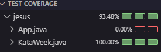

# Gestor de Días de la Semana

[](https://www.oracle.com/java/)
[](https://junit.org/junit5/)
[](https://maven.apache.org/)

Una clase Java para gestionar los días de la semana con operaciones básicas CRUD.

## Requisitos

- JDK 21
- Maven 3.9.6+
- JUnit 5 (incluido en las dependencias)

## Instalación

1. Clonar el repositorio:

```bash
git clone https://github.com/jemb4/kata-list-week
```

2. Compilar con Maven:

```bash
mvn clean install
```

## Características:

1. La clase debe tener los siguientes métodos:

- Un método para crear la lista de los días de la semana
- Un método que retorne los días de la semana
- Un método que retorne el largo de la lista
- Un método para eliminar un día de la semana
- Un método que retorne el día de la semana solicitado
- Un método que retorne si el día solicitado existe en la lista
- Un método para ordenar la lista de días por orden alfabético
- Un método para vaciar la lista

## Requisitos:

- Se debe realizar un test unitario de cada método
- Se debe utilizar la colección "List" de java.util

## 📸 Test Coverage:


